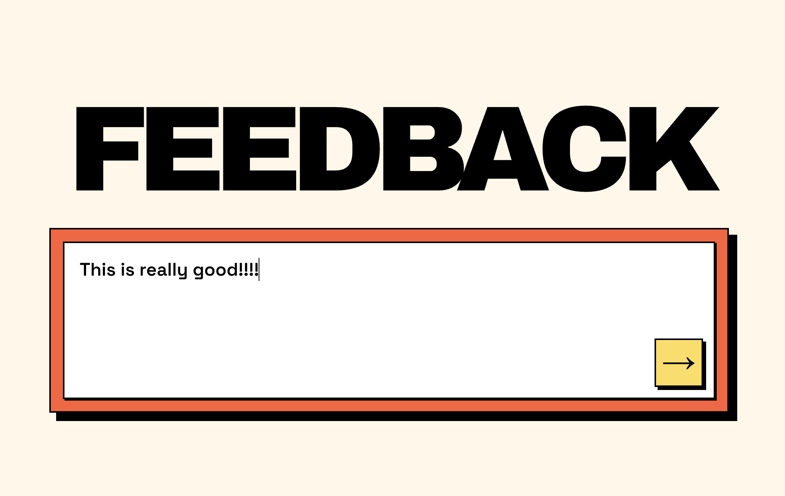

# Truth Be Told

Anonymous, constructive feedback for creators. Submitters send one message; the product only becomes conversational when feedback lacks enough actionable signal to be useful.

## Repo

| Path | What |
|------|------|
| [`docs/MVP.md`](docs/MVP.md) | Product spec and implementation plan |
| [`docs/FUTURE_CONSIDERATIONS.md`](docs/FUTURE_CONSIDERATIONS.md) | Deferred ideas and decision triggers |
| [`frontend/`](frontend/) | Next.js app (campaign UI) |
| [`evaluation/`](evaluation/) | Prompts and golden-dataset evals |

## Docs

Start with [`docs/MVP.md`](docs/MVP.md) for goals, user flows, and locked product decisions.
