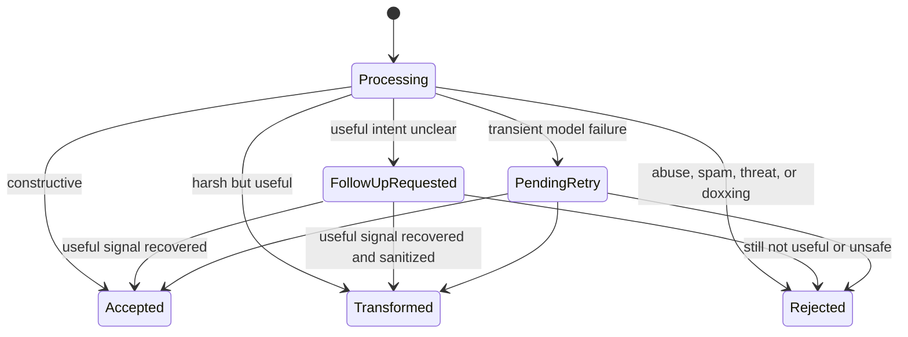
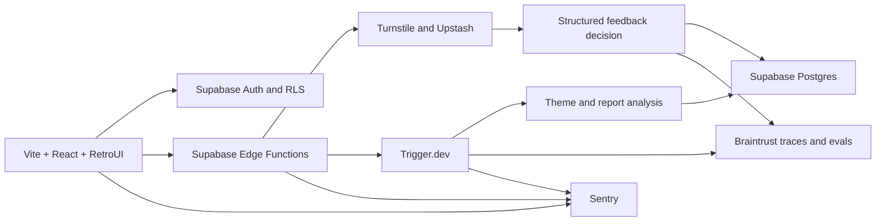

# Truth Be Told — MVP Specification

Status: ready for implementation planning

Product type: anonymous, constructive feedback platform

Primary implementation language: TypeScript

## 1. Product goal

Truth Be Told lets a creator publish an anonymous feedback campaign and receive feedback that is useful without being exposed to direct abuse.

The product should feel as easy to enter as an anonymous-message form. It should become conversational only when a submission lacks enough constructive signal to be useful.

The MVP succeeds when:

1. A creator can create and share a campaign in a few minutes.
2. A submitter can send already-constructive feedback with one message.
3. Harsh feedback with a useful point reaches the creator without direct abuse.
4. A single adaptive follow-up can recover useful feedback from some vague or abusive submissions.
5. Creators can review individual feedback, grouped themes, and a concise campaign summary.
6. Prompt or model changes can be measured against a versioned golden dataset.

## 2. Locked product decisions

- Only creators require accounts.
- Submitters do not create accounts.
- The public entry point is a single large feedback input, not a chat screen.
- The interface becomes conversational only when the initial message lacks a recoverable actionable signal.
- The MVP allows at most one AI-generated follow-up question.
- Constructive feedback is accepted immediately.
- Harsh feedback that already contains a useful point is transformed and accepted immediately.
- The submitter does not preview the transformed result.
- The creator does not see an item-level label indicating that feedback was transformed.
- Voluntary self-identifying information is allowed.
- Threats and doxxing are rejected and never shown in the creator dashboard.
- The MVP does not use an agent framework.
- The AI workflow is a bounded, typed state machine implemented in ordinary TypeScript.
- Trigger.dev owns durable background work.
- Supabase Edge Functions own public HTTP endpoints.
- Braintrust owns model traces, datasets, and evaluations.
- RetroUI components must be used verbatim.

## 3. Users

### Creator

A creator can:

- Sign up and sign in.
- Create, open, close, and delete a feedback campaign.
- Copy a public campaign URL.
- Review creator-visible feedback.
- View themes and an actionable summary.
- Create and revoke a shareable report link.

### Submitter

A submitter can:

- Open a public campaign URL.
- Read the campaign prompt.
- Enter anonymous text feedback.
- Complete one short follow-up when needed.
- Receive a simple submitted or not-submitted result.

## 4. Core user flows

### 4.1 Creator campaign flow

1. Creator signs in.
2. Creator creates a campaign with:
   - Title.
   - Feedback question or prompt.
   - Optional short context.
   - Optional expiry date.
3. The system creates a unique public slug.
4. Creator copies and shares the public URL.
5. Creator opens the campaign dashboard to view results.
6. Creator can close submissions at any time.

### 4.2 Submitter flow

1. Submitter opens `/c/:slug`.
2. The page shows the campaign title, prompt, optional context, and one large text input.
3. Submitter enters feedback and selects **Send anonymously**.
4. The application verifies CAPTCHA and rate limits.
5. The model returns one structured decision:
   - `accept`
   - `transform`
   - `ask_follow_up`
   - `reject`
6. The UI responds:
   - `accept` or `transform`: show success immediately.
   - `ask_follow_up`: show one short question and a reply input.
   - `reject`: explain that a specific behavior or desired change is required.
7. When a follow-up is answered, the system makes one final decision. It never asks a second follow-up in the MVP.

### 4.3 Creator results flow

1. Creator opens a campaign.
2. Creator sees accepted creator-visible feedback in reverse chronological order.
3. Creator can switch to a themes view.
4. Creator sees an actionable campaign summary.
5. Creator can regenerate analysis.
6. Creator can create or revoke a shareable aggregate report.

## 5. Feedback state machine



Rules:

- A constructive submission must not be made conversational.
- A harsh submission with a specific actionable point must not be made conversational.
- A follow-up targets exactly one missing element:
  - Specific behavior.
  - Concrete example.
  - Effect or impact.
  - Desired change.
- The assistant must not debate, lecture, shame, counsel, or claim that every abusive message has a constructive intent.
- If useful signal is still missing after one follow-up, reject the submission.
- A model or network failure must not accidentally publish unreviewed feedback to the creator.

## 6. Follow-up question policy

The model should select from a small product-controlled set of question intents. The MVP may use fixed copy rather than unconstrained generation.

Suggested templates:

- `specific_behavior`: “What specifically did they do that should change?”
- `concrete_example`: “Can you give one concrete example?”
- `impact`: “What effect did that have?”
- `desired_change`: “What should they do differently?”

The UI introduces it with:

> One quick question before this is sent:

There is no greeting, bot biography, typing simulation, or open-ended assistant conversation.

## 7. Technical stack

| Concern | MVP choice |
|---|---|
| Frontend | React, Vite, TypeScript |
| UI components | RetroUI, Tailwind CSS |
| Package manager | Bun |
| Frontend hosting | Vercel |
| Authentication | Supabase Auth |
| Database | Supabase Postgres |
| Authorization | Postgres Row Level Security |
| Public/backend endpoints | Supabase Edge Functions |
| Background jobs | Trigger.dev |
| Model abstraction | AI SDK Core |
| Runtime validation | Zod |
| AI observability/evals | Braintrust |
| Application errors | Sentry |
| Rate limiting | Upstash Redis |
| CAPTCHA | Cloudflare Turnstile |

### Runtime boundaries

- The Vite application runs in the browser and is deployed as a Vercel frontend.
- Supabase Edge Functions run in a Deno-compatible TypeScript runtime.
- Trigger.dev tasks run in a Node.js TypeScript runtime.
- Bun is the repository package manager and local script runner. It is not assumed to be the production runtime for Edge Functions or Trigger.dev.
- Shared packages must avoid runtime-specific APIs unless they are explicitly isolated.

## 8. High-level architecture



### Submission request path

1. Browser calls the `submit-feedback` Edge Function.
2. Edge Function validates campaign state, payload, Turnstile, and rate limit.
3. Edge Function creates a private intake record.
4. Edge Function performs the bounded structured classification.
5. It returns either a final result or a follow-up question.
6. A follow-up response calls `continue-feedback`.
7. Accepted/transformed feedback creates a creator-visible feedback record.
8. The Edge Function triggers a background analysis job.
9. Trigger.dev regenerates campaign themes and summaries.

If importing the Trigger.dev SDK into the Deno runtime causes compatibility problems, the Edge Function should call the Trigger.dev Tasks HTTP API with `fetch`.

## 9. Suggested repository structure

```text
apps/
  web/
    src/
      components/
        retroui/
      features/
        auth/
        campaigns/
        feedback/
        reports/
      pages/
      lib/

packages/
  contracts/
    src/
      campaign.ts
      feedback.ts
      report.ts
  ai/
    src/
      feedback-decision.ts
      prompts.ts
      provider.ts

supabase/
  functions/
    submit-feedback/
    continue-feedback/
    regenerate-report/
    create-share-link/
    revoke-share-link/
  migrations/

trigger/
  process-pending-submission.ts
  regenerate-campaign-analysis.ts

evals/
  feedback-decision.eval.ts
  transformation-faithfulness.eval.ts
  fixtures/
```

## 10. Data model

Names are provisional but responsibilities should remain separated.

### `campaigns`

- `id`
- `creator_id`
- `slug`
- `title`
- `prompt`
- `context`
- `status`: `draft | open | closed`
- `expires_at`
- `created_at`
- `updated_at`

RLS:

- Creator can select and mutate only their campaigns.
- Anonymous users cannot query campaign rows directly.
- The public campaign Edge Function returns only public campaign fields.

### `submission_intake`

Private service-only data:

- `id`
- `campaign_id`
- `state`
- `turn_count`
- `initial_text`
- `follow_up_intent`
- `follow_up_question`
- `follow_up_answer`
- `created_at`
- `completed_at`

Creators must never receive direct access to this table.

### `feedback_items`

Creator-visible feedback:

- `id`
- `campaign_id`
- `display_text`
- `useful_points` as JSONB
- `category`
- `severity`
- `created_at`

The creator-facing API or database view must not expose the original abusive text or the internal transformation outcome.

### `model_decisions`

Private service-only model audit data:

- `id`
- `submission_id`
- `decision`
- `reason_codes`
- `confidence`
- `model`
- `prompt_version`
- `schema_version`
- `latency_ms`
- `token_usage`
- `created_at`

### `themes`

- `id`
- `campaign_id`
- `label`
- `description`
- `frequency`
- `severity`
- `analysis_version`

### `theme_memberships`

- `theme_id`
- `feedback_item_id`
- `confidence`

### `reports`

- `id`
- `campaign_id`
- `summary`
- `action_items` as JSONB
- `analysis_version`
- `generated_at`

### `share_links`

- `id`
- `campaign_id`
- `token_hash`
- `revoked_at`
- `expires_at`
- `created_at`

The raw share token is returned only at creation time. Store only a hash.

## 11. API contracts

### `submit-feedback`

Input:

```ts
{
  campaignSlug: string;
  text: string;
  turnstileToken: string;
}
```

Possible outputs:

```ts
type SubmitFeedbackResult =
  | { status: "submitted" }
  | {
      status: "follow_up";
      sessionToken: string;
      question: string;
    }
  | {
      status: "not_submitted";
      message: string;
    };
```

### `continue-feedback`

Input:

```ts
{
  sessionToken: string;
  answer: string;
  turnstileToken?: string;
}
```

Output:

```ts
type ContinueFeedbackResult =
  | { status: "submitted" }
  | {
      status: "not_submitted";
      message: string;
    };
```

### Internal structured model result

```ts
const FeedbackDecision = z.object({
  action: z.enum([
    "accept",
    "transform",
    "ask_follow_up",
    "reject",
  ]),
  category: z.enum([
    "constructive",
    "harsh_useful",
    "vague",
    "abuse",
    "spam",
    "threat",
    "doxxing",
  ]),
  severity: z.enum(["none", "low", "medium", "high", "critical"]),
  usefulPoints: z.array(z.string()),
  displayText: z.string().nullable(),
  followUpIntent: z
    .enum([
      "specific_behavior",
      "concrete_example",
      "impact",
      "desired_change",
    ])
    .nullable(),
  confidence: z.number().min(0).max(1),
  reasonCodes: z.array(z.string()),
});
```

Application code, not the model, enforces:

- Maximum turn count.
- Which states are creator-visible.
- Whether a follow-up is allowed.
- Whether the campaign is open.
- Request size and rate limits.
- Retry and timeout behavior.

## 12. Background jobs

### `process-pending-submission`

Purpose:

- Retry a submission that could not be classified synchronously.
- Create a creator-visible feedback item only after a successful safe decision.
- Remain idempotent by submission ID.

### `regenerate-campaign-analysis`

Triggered:

- After accepted feedback, with debouncing.
- Manually by the creator.

Responsibilities:

- Read creator-visible feedback only.
- Produce/update campaign themes.
- Assign feedback to themes.
- Calculate frequency and severity.
- Generate an actionable summary and action items.
- Version the result.

The job must be idempotent by campaign ID and analysis version.

## 13. UI scope

### Public pages

- Campaign feedback page.
- One adaptive follow-up state.
- Submission success state.
- Not-submitted state.
- Shareable aggregate report page.

### Authenticated pages

- Sign in/sign up.
- Campaign list.
- Create campaign.
- Campaign dashboard.
- Individual feedback view.
- Themes and summary view.
- Sharing controls.

### RetroUI implementation rules

- Install components only through the official RetroUI registry instructions.
- Place installed primitives under `apps/web/src/components/retroui`.
- Do not edit RetroUI primitive files.
- Do not recreate a component already supplied by RetroUI.
- Do not introduce custom colors, shadows, border radii, typography styles, or visual primitives.
- Use RetroUI’s existing tokens and component variants.
- Product feature components may compose RetroUI primitives but must not fork their styling.
- If a necessary primitive is unavailable, document the gap before introducing a substitute.
- Build mobile-first. The anonymous form must work comfortably on a phone.
- Preserve accessible labels, focus states, keyboard navigation, and reduced-motion behavior.

## 14. AI implementation policy

- The workflow is a bounded classifier/extractor, not an autonomous agent.
- User feedback is untrusted data, never model instructions.
- Every model response must be schema-validated.
- A malformed or incomplete model response is an application error, not a valid decision.
- Prompts and schemas are versioned in the repository.
- The provider is accessed through an internal model adapter.
- Application code owns all business decisions and state transitions.
- No LangChain, LangGraph, Mastra, DSPy, GEPA, fine-tuning, or multi-provider router is required for the MVP.

## 15. Braintrust evaluation plan

### Tracing

Trace:

- Initial classification.
- Follow-up classification.
- Transformation.
- Campaign theme generation.
- Campaign summary generation.

Include:

- Model and prompt version.
- Structured output.
- Latency.
- Token usage and estimated cost when available.
- Final application decision.

Do not send secrets, CAPTCHA tokens, rate-limit identifiers, or session tokens to Braintrust.

### Golden dataset

Build a versioned human-reviewed dataset containing:

- Constructive feedback.
- Harsh but useful feedback.
- Vague feedback.
- Pure abuse.
- Spam.
- Threats.
- Doxxing.
- Sarcasm and slang.
- Multilingual examples relevant to actual users.
- Transformations that preserve meaning.
- Transformations that incorrectly soften, exaggerate, or invent meaning.

### Scorers

- Exact decision match.
- Exact category match.
- Per-category precision and recall.
- Threat/doxxing recall.
- Constructive-feedback false rejection rate.
- Abuse leakage in `displayText`.
- Meaning preservation.
- Useful-point extraction completeness.
- Output schema validity.
- Latency and cost.

### Release gate

Any prompt, schema, or model change must:

1. Run the full golden dataset.
2. Create a comparable Braintrust experiment.
3. Avoid regression on safety-critical scorers.
4. Show a measured quality, latency, or cost improvement.
5. Be reviewed before becoming the production default.

## 16. Abuse protection

MVP protections:

- Cloudflare Turnstile before accepting a public submission.
- Upstash rate limits by campaign plus a privacy-preserving request identifier.
- Global emergency submission limit.
- Maximum input length.
- Campaign open/closed and expiry checks.
- Idempotency token to reduce duplicate submissions.
- No raw feedback in ordinary application logs.

Exact rate-limit values should be configuration, not hardcoded product assumptions.

## 17. Error handling

- Sentry covers the Vite application, Edge Functions, and Trigger.dev tasks where supported.
- Public errors use neutral, non-technical copy.
- Model timeouts create a pending retry rather than exposing unreviewed feedback.
- Background jobs use retries and idempotency keys.
- A failed theme or report job must not remove the last successful report.
- Creator-visible feedback is immutable except for creator hide/delete controls added during implementation if necessary.

## 18. Explicitly out of scope

- Full multi-turn AI interview.
- Agent framework.
- Voice input.
- Speech-to-text.
- Adaptive follow-ups beyond one question.
- Peer-environment insights or demographic comparisons.
- Fine-tuned or self-hosted models.
- Automatic prompt optimization with DSPy, GEPA, or Ax.
- Multi-provider routing and automatic failover.
- Separate vector database.
- Advanced semantic clustering infrastructure.
- Product analytics platform.
- Native mobile applications.
- Creator teams and organizations.
- Payments and subscriptions.
- Invite-only campaigns.
- Human moderation console.
- Full policy appeals workflow.

## 19. Implementation milestones

### Milestone 1 — Foundation

- Create Vite/React/TypeScript application.
- Configure Bun workspace.
- Install Tailwind and RetroUI.
- Configure Supabase project and local development.
- Add database migrations and RLS.
- Add creator authentication.
- Add Sentry.

### Milestone 2 — Campaigns

- Campaign create/list/detail flows.
- Public campaign slug lookup.
- Open/close and expiry behavior.
- Copy public URL.

### Milestone 3 — Feedback intake

- Public one-input feedback page.
- Turnstile and rate limiting.
- `submit-feedback` Edge Function.
- Structured model decision.
- One adaptive follow-up.
- Accepted/transformed creator-visible record.
- Rejection behavior, including threats and doxxing.

### Milestone 4 — Creator dashboard

- Feedback inbox.
- Campaign filters and states.
- Empty/loading/error states.
- Creator cannot access private intake text.

### Milestone 5 — Analysis

- Trigger.dev integration.
- Theme generation.
- Summary and action items.
- Manual regeneration.
- Idempotent/debounced processing.

### Milestone 6 — Sharing and evaluation

- Shareable aggregate report.
- Revoke share link.
- Braintrust tracing.
- Initial golden dataset.
- Evaluation scripts and release gate.

## 20. Definition of done

The MVP is complete when:

- A creator can authenticate and create an open campaign.
- A public visitor can submit constructive feedback without an account.
- Constructive feedback requires no conversational follow-up.
- A vague or abusive submission can receive at most one follow-up.
- Harsh useful feedback is sanitized before the creator can see it.
- Rejected content and original abusive content cannot be accessed through creator-facing queries.
- Accepted feedback appears in the creator dashboard.
- Themes and a summary can be generated and regenerated.
- A share link can be created and revoked.
- Rate limiting and CAPTCHA protect the public endpoint.
- Model operations are traced in Braintrust.
- The golden evaluation dataset runs locally and in CI.
- RetroUI primitives remain unmodified.
- Relevant tests, type checks, builds, migrations, and RLS checks pass.

## 21. Technical references

- RetroUI with Vite: <https://www.retroui.dev/docs/install/vite>
- Vite: <https://vite.dev/guide/>
- Vite on Vercel: <https://vercel.com/docs/frameworks/frontend/vite>
- Supabase Edge Functions: <https://supabase.com/docs/guides/functions>
- Trigger.dev with Supabase Edge Functions: <https://trigger.dev/docs/guides/frameworks/supabase-edge-functions-basic>
- Trigger.dev durable tasks: <https://trigger.dev/docs/how-it-works>
- AI SDK structured output: <https://ai-sdk.dev/docs/ai-sdk-core/overview>
- Braintrust evaluations: <https://www.braintrust.dev/docs/evaluate>
